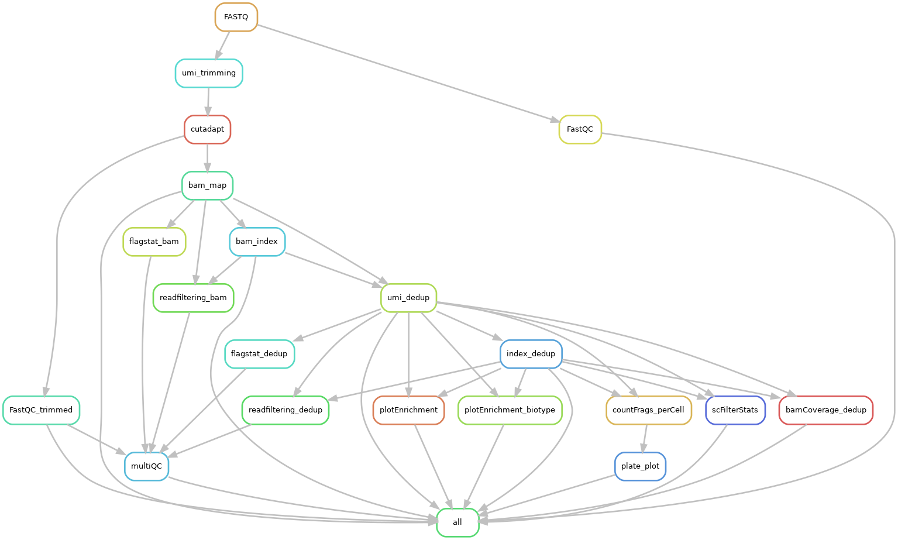

# scChICflow

Workflow for processing of [single-cell sortChIC](https://www.ncbi.nlm.nih.gov/pmc/articles/PMC9925381/) and [single-cell TChIC](https://www.biorxiv.org/content/10.1101/2024.05.09.593364v1.abstract) data.

**Author: Vivek Bhardwaj (@vivekbhr)**

## Installation and configuration

We assume that the users have python (>=3.8) installed via a conda package manager, such as [miniconda](https://docs.conda.io/en/latest/miniconda.html) or [miniforge] (https://github.com/conda-forge/miniforge). Please check the instructions on how to install conda on that website.


### 1. Download this repository

Move to an appropriate folder and run:

```
git clone https://github.com/vivekbhr/scChICflow.git
```

### 2. Set up the tools needed for the workflow

Go to the scChICflow directory and install the tools using conda.

```
cd scChICflow
conda env create -f env.yaml -n chicflow
```

**Note:** Setup of this conda environment has been tested with linux, and conda v23. If it takes too long and/or creates conflicts, try removing the conflicting packages from the `env.yaml` file and installing them manually afterwards.

Additionally the tool `split_fastq.py` needs to be installed manually for the TChIC workflow:

```
cd scChICflow/tools && python splitfastq_install.py build_ext --inplace && cd -
```


### 3. Prepare the config.yaml

The workflow needs user to specify:

  1) path to the (indexed) genome fasta file
  2) path to BWA index of the genome (basename) or to the HISAT2  index on the genome depending on the dna aligner chosen (`dna_aligner` flag specified on `config.yaml`)
  3) path to  cell barcodes (`testdata/chic_384barcodes.txt` file)
	4) other parameters and files (see explanation in the `testdata/config.yaml` file)

For the real run, copy the `test_config.yaml` from the `testdata` folder to the folder where you intend to run the pipeline and replace the information with your relevant information.


## Executing the workflow

**Test a full run of the workflow with the provided test input files.**

This should only take ~5 minutes. Unzip the contents of `testdata/testdata.tar.gz` and run the example workflow.

```
cd <scChICflow_folder>/testdata && tar -xvf testdata.tar.gz
conda activate chicflow
../scChICflow -i input -o . -c test_config.yaml -j 5
```

Here **j** is the number of parallel jobs you want to run. For other parameters, check out `scChICflow --help`

### Running on HPC cluster

By default the workflow runs locally. To run the workflow on an HPC cluster, the `-cl` flag needs to be added to the `scChICflow` command. Running scChICflow on the cluster also requires a `profile/config.yaml` file.
We provide an example `profile/config.yaml` file in this repository that requires some changes to run a specific cluster (e.g.: adjusting the temporary directory and email for job updates).
The `profile/config.yaml` also allows the user to allocate different resources per rule following [Snakemake's resource allocation rules] (https://snakemake.readthedocs.io/en/stable/snakefiles/rules.html). We provide our recommended defaults in the example `profile/config.yaml`.
scChICflow can be run on a cluster can be run directly from the command line or by submitting a **"master job"** script (example in `example_SLURM`). In both cases, scChICflow will submit individual cluster jobs per rule.

In summary, to run scChICflow on the cluster:

  1. Make adjustments to `profile/config.yaml` for your cluster
  2. Run scChICflow with the `-cl` flag either:
  * On the **command line**
  * Via a **"master job"** script (example at `example_SLURM`) and submit the script to the cluster

Both approaches will run each Snakemake rule as a separate cluster job.

#### Note on running HISAT2 on the cluster
Unfortunately, the current version of **HISAT2** (2.2.1) has a hard-coded directory for temporary files at `/tmp`. This may cause issues depending on cluster setup, since many clusters allocate temporary directory space at other locations such as `/scratch/$JOB_ID`. In case of HISAT2 issues, we recommend using the **bwa** aligner instead (specified via the `dna_aligner` flag on the workflow `config.yaml` file).

### Description of workflow steps

**The following DAG (Directed Acyclic Graph) shows the processing steps inside the workflow (with protocol: chic)**



 - FASTQ: Raw .fastq formatted files from sequencing output. Read 1 from these files contain a 3 base UMI, a 8 base barcode and (expected) "A" base (due to A-tailing) followed by the genomic sequence (cut-site).
 - umi_trimming: This step uses `umi_tools extract`, with the barcode sequence ( `--extract-method=string --bc-pattern=NNNCCCCCCCC`) to remove the UMI and barcode sequence from the read and add them into the read header.
 - FastQC/FastQC_trimmed: The FastQC tool checks base qualities and composition.
 - cutadapt: This (optional) step uses the tool cutadapt to trim low quality bases and leftover illumina adapters.
 - bam_map: This step uses an alignment tool (such as bwa-mem, bowtie2 or hisat) to align reads to the genome in paired-end mode, leading to a BAM file.
 - umi_dedup: Followed by mapping, `umi_tools dedup --per-cell` is used to remove PCR and IVT duplicate reads from the BAM file based on the mapping position, the cell barcode and the UMI sequence (stored in the read header). We recommend the options: `--method unique --spliced-is-unique --soft-clip-threshold 2`, which keeps high stringency during de-duplication.
 - index_dedup: Uses `samtools index` to create an index for the de-duplicated BAM file.
countFrags_percell: At this step, we use the function `scCountReads bins -bs 50000 ` from our single-cell analysis toolkit [**sincei**](https://sincei.readthedocs.io/en/latest/), to count reads in 50kb genomic windows per cell. Counting in different window sizes, or different genomic features (promoters/peaks etc.) is useful to extract meaningful signals from ChIC data (see Note 9).
 - plate plot: A custom R script in scChICflow is used to plot the number of reads per well (output of scCountReads) on a 384-well plate layout. This is useful to detect the effect of a liquid handling robot on read counts.
 - plotEnrichment, bamCoverage, estimateReadFiltering, bigwigSummary, plotCorrelation: Functions available within the [**deepTools**](https://deeptools.readthedocs.io/en/develop/) package that allow per-plate QC of ChIC-seq (and similar) data.
 - multiQC: This tool summarises the QC reports from various steps above, and allows us to compare qualities across multiple plates.


### Expected output

After the workflow runs successfully, the output directory would look like this:

```
├── FASTQ
├── FASTQ_trimmed
│   ├── sortChIC-k4me1_chr1-118-120M_R1.fastq.gz
│   └── sortChIC-k4me1_chr1-118-120M_R2.fastq.gz
├── mapped_bam
│   ├── sortChIC-k4me1_chr1-118-120M.bam
│   └── sortChIC-k4me1_chr1-118-120M.bam.bai
├── counts
│   └── sortChIC-k4me1_chr1-118-120M.per_barcode.tsv
├── coverage
│   └── sortChIC-k4me1_chr1-118-120M_dedup.cpm.bw
├── dedup_bam
│   ├── sortChIC-k4me1_chr1-118-120M.bam
│   └── sortChIC-k4me1_chr1-118-120M.bam.bai
├── QC
│   ├── cutadapt
│   ├── FastQC
│   ├── FastQC_trimmed
│   ├── featureEnrichment_biotype.png
│   ├── featureEnrichment.png
│   ├── multiqc_data
│   ├── multiqc_report.html
│   ├── plate_plots.pdf
│   ├── scFilterStats.txt
│   └── umi_dedup
├── logs
├── cluster_logs
├── scChICflow_config.yaml
├── scChICflow.log
├── test_config.yaml
├── test_annotations
└── test_input

```

**For a better understanding of the processing steps and the output files, have a look at our [sortChIC book chapter]()**

## Notes

**Technical Notes**

  - After running the pipeline, **LOG** file are stored in the **<output>/log/** directory and the workflow top-level log is in scChICflow.log file.
  - Currently the -o option is not very flexible and and pipeline works only when it's executed in the output directory.
  - Cluster configuration, such as memory and cluster submission command are placed in `cluster_config.yaml`, and can be modified to suite the users internal infrastructure.
	- Installation of [sincei package](https://sincei.readthedocs.io/en/latest/): it's possible that conda installs a broken version of sincei package while resolving your conda environment from `env.yaml`. In that case, I'd suggest installing sincei manually, and (if needed) providing the path to sincei binaries under `config.yaml` using the keyword `sincei_path:</path/to/sincei/bin/>`


**TAPS analysis notes (before version 0.3)**
  - Quality-trimming of the data seems to remove the NLA3 sequences from the 5'-end of R1, which leads to
    rejection of reads during methylation tagging in the NLA-TAPS library. Turn 'trim: False' in the config.yaml to
    turn off trimming for NLA-TAPS library
