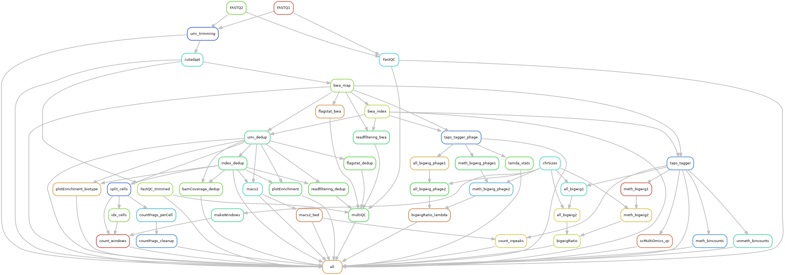

# scChICflow

Workflow for processing of [single-cell sortChIC](https://www.ncbi.nlm.nih.gov/pmc/articles/PMC9925381/) data.

**Author: @vivekbhr**

## Installation and configuration

We assume that the users have python (>=3.8) installed via a conda package manager, such as [miniconda](https://docs.conda.io/en/latest/miniconda.html). Please check the instructions on how to install conda on that website. I'd recommend installing [mamba](https://anaconda.org/conda-forge/mamba) to resolve the package dependencies.


**1. Download this repository**

Move to an appropriate folder and run:

```
git clone https://github.com/vivekbhr/scChICflow.git
```

**2. Go to the scChICflow directory and set up the tools needed for the workflow**

```
cd scChICflow
mamba env create -f env.yaml -n chicflow
```

Note: Setup of this conda environment has been tested with linux, and conda v23. If it takes too long and/or creates conflicts, try removing the conflicting packages from the `env.yaml` file and installing them manually afterwards.


### 3. Prepare the config.yaml

The workflow needs user to specify:

  1) path to the (indexed) genome fasta file
  2) path to BWA index of the genome (basename)
  3) path to  cell barcodes (`testdata/chic_384barcodes.txt` file)
  4) path to a bed file with blacklisted regions in the genome (optional)
	5) other parameters (see explanation in the `testdata/config.yaml` file)

For the real run, copy the `config.yaml` from the `testdata` folder to the folder where you intend to run the pipeline and replace the information with your relevant information.


## Executing the workflow

**Test a full run of the workflow with the provided test fasta files.**

This should only take ~5 minutes. Unzip the contents of `testdata/testdata.tar.gz` and run the example workflow.

```
cd <scChICflow_folder>/testdata && tar -xvf testdata.tar.gz
conda activate chicflow
../scChICflow -i input -o . -c test_config.yaml -j 5
```

Here **j** is the number of parallel jobs you want to run. For other parameters, check out `scChICflow --help`

### Running on HPC cluster

By default the workflow runs locally. To run the workflow on an HPC cluster, specify the execution command (that uses a manager like slurm/SGE) under `cluster_config.yaml` and specity **-cl** for `scChICflow` command.


### During execution

**The following DAG (Directed Acyclic Graph) shows the processing steps inside the workflow**



### Expected output

After the workflow runs successfully, the output directory would look like this:

```
├── FASTQ
├── FASTQ_trimmed
│   ├── sortChIC-k4me1_chr1-118-120M_R1.fastq.gz
│   └── sortChIC-k4me1_chr1-118-120M_R2.fastq.gz
├── mapped_bam
│   ├── sortChIC-k4me1_chr1-118-120M.bam
│   └── sortChIC-k4me1_chr1-118-120M.bam.bai
├── counts
│   └── sortChIC-k4me1_chr1-118-120M.per_barcode.tsv
├── coverage
│   └── sortChIC-k4me1_chr1-118-120M_dedup.cpm.bw
├── dedup_bam
│   ├── sortChIC-k4me1_chr1-118-120M.bam
│   └── sortChIC-k4me1_chr1-118-120M.bam.bai
├── QC
│   ├── cutadapt
│   ├── FastQC
│   ├── FastQC_trimmed
│   ├── featureEnrichment_biotype.png
│   ├── featureEnrichment.png
│   ├── multiqc_data
│   ├── multiqc_report.html
│   ├── plate_plots.pdf
│   ├── scFilterStats.txt
│   └── umi_dedup
├── logs
├── cluster_logs
├── scChICflow_config.yaml
├── scChICflow.log
├── test_config.yaml
├── test_annotations
└── test_input

```

**For a better understanding of the processing steps and the output files, have a look at our [sortChIC book chapter]()**

## Notes

### Technical Notes
  - After running the pipeline, **LOG** file are stored in the **<output>/log/** directory and the workflow top-level log is in scChICflow.log file.
  - Currently the -o option is not very flexible and and pipeline works only when it's executed in the output directory.
  - cluster configuration, such as memory and cluster submission command are placed in `cluster_config.yaml`, and can be modified to suite the users internal infrastructure.

**TAPS analysis notes (before version 0.3) **
  - Quality-trimming of the data seems to remove the NLA3 sequences from the 5'-end of R1, which leads to
    rejection of reads during methylation tagging in the NLA-TAPS library. Turn 'trim: False' in the config.yaml to
    turn off trimming for NLA-TAPS library
